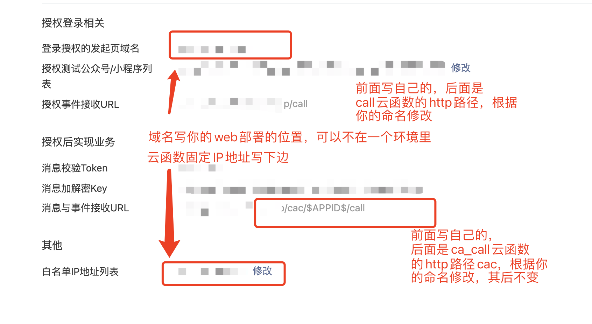

# CloudBase TSP
## 云开发第三方服务平台示例（企业名片）

### 一、项目介绍

先看个刷个[帖子](https://developers.weixin.qq.com/community/minihome/doc/000a0c8dcf02985e249c4d9c651000)，看个视频吧！

本项目使用微信开放平台-第三方平台服务商，并配合云开发批量代开发能力制作。

可以对授权的小程序自动部署应用和云开发服务（环境在第三方平台），并含有客服消息系统，方便进一步企业联系

### 二、部署步骤

部署大体分如下几步，我尽可能梳理了，建议你系统学习完微信开放平台知识和云开发知识后再来实践，否则会很痛苦。

如果你想简单起步，我从这个项目中提炼了一个简单的登录DEMO，并支持一键部署，可以先尝试体验，然后再来这里。[项目地址](https://github.com/TCloudBase/MP-TSP-AuthDemo)

-----

1. 开通微信开放平台并进行微信认证
2. 开通第三方平台服务商
3. 在服务商中开通云开发，并登录开通的腾讯云账号(或绑定自己已有的腾讯云账号)
4. 创建一个按量云开发环境，开通匿名登录，下载自定义登录密钥，开通静态网站托管
5. 自定义密钥放在此目录下替换，命名要一致【cloudfunctions/component_server/config/tcb_custom_login.json】
6. 将项目目录中cloudfunction中三个云函数部署
7. 对ca_call、call两个云函数配置HTTP访问，获取接收的URL
8. 对三个云函数开启固定IP地址，获取IP地址后填入第三方开放平台
9. 在服务商配置中填写对应接收url以及IP白名单，效果如下：
   
10. 将服务商设置信息写入监听云函数2个配置文件中【cloudfunctions/*/key.json】
    ``` json
    {
      "appId": "", // 微信公众平台的appid
      "encodingAESKey": "", // 上述步骤设置的消息加密Key
      "token": "" // 消息校验Token
    }
    ```
11. 将服务商设置信息写入component_server云函数的配置文件中【cloudfunctions/component_server/config/key.json】
    ``` json
    {
      "component_appid": "", // 微信公众平台的appid
      "component_appsecret": "", // 微信公众平台的APPSECRET，在详情页重置，记得保存好
      "redirect_uri":"" // 发起页域名，也就是你要把webviews内容部署在哪里，可以和云函数所在环境不一样（需要配置安全域名）
    }
    ```
12. 绑定开发小程序，并使用开发者工具将项目miniprogram上传草稿箱
13. 对草稿箱转模版小程序，获得版本号
14. 将版本号重新写入component_server配置中【cloudfunctions/component_server/config/mini.json】
    ``` json
    {
      "vid": 1, // 版本号，按照实际要求填写
      "version": "1.0.0", // 自己定义的版本号，注意是数字小数点形式
      "des": "TSP第三方平台上传" // 对版本的描述
    }
    ```
15.  重新部署三个云函数，更新配置文件
16.  将项目webview/js/index.js中环境ID写为自己环境ID【webviews/js/index.js】
17.  上传部署webview到你的域名所在网站服务器下
18.  访问上传所在域名地址

### 三、写在最后

- 整个项目花了3天，共40小时多搞定的，主要目的是为了测试整个第三方平台与云开发的结合使用问题，也组合了一些模块，搞了个应用纯属脑热仓促，我review之后感觉代码写的太糟糕了，不过全部原生开发，适合理解学习。
- 你大概没有那么容易一下完成所有内容，并且其中会有各种报错，导致你陷入僵局。原因有的是你没有正确操作一些步骤，有一些是我在做标准化时改错了一些东西，这不是故意的，还在完善过程中。
- 云云学长（zirali），云开发、微信生态领域专家
